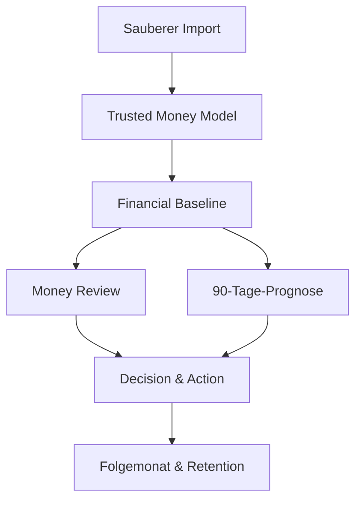

# assetagent: Entwicklungs-Roadmap vom Prototyp zur Paid Beta

**Stand:** 1. August 2026  
**Zeithorizont:** 12 Wochen / ca. 90 Tage  
**Ausgangspunkt:** funktionierender lokaler Prototyp mit Sparkassen-CSV-Import per CLI, Postgres, React-Konsole und tool-grounded Chat  
**Ziel:** ein nichttechnisch nutzbares, vertrauenswürdiges Produkt, für das erste Haushalte tatsächlich bezahlen

## 1. Zielbild nach zwölf Wochen

Ein Nutzer kann ohne Terminal:

1. einen Sparkassen-CSV-Export hochladen und vor dem Import prüfen,
2. Konten benennen und interne Transfers korrigieren,
3. Kategorien, Händler und wiederkehrende Kosten bestätigen,
4. fünf zentrale Haushaltszahlen nachvollziehen,
5. einen persistierten Monthly Money Review erzeugen,
6. eine transparente 90-Tage-Prognose und wenige definierte Szenarien berechnen,
7. eine konkrete finanzielle Maßnahme festhalten,
8. im Folgemonat deren Wirkung überprüfen,
9. das Produkt ohne Entwicklungsumgebung installieren,
10. Founding Pro kaufen beziehungsweise aktivieren.

Das Release-Ziel ist ausdrücklich **keine vollständige Personal-Finance-Suite**. Erfolgreich ist die Roadmap, wenn mindestens zehn Nutzer bezahlen, die Kernzahlen belastbar sind und mindestens 40 % im Folgemonat erneut einen Review durchführen.

## 2. Entwicklungsprinzipien

### 2.1 Finanzlogik vor Chat-Komfort

Die zentrale Abhängigkeitskette lautet:



Ein Review darf nicht auf unsauberen Transfers, doppelten Importen oder LLM-berechneten Summen aufbauen. Deshalb werden Chat-History, weitere Modelle und optische Dashboard-Erweiterungen zurückgestellt.

### 2.2 Das LLM ist Erklärer und Orchestrator, nicht Rechenmaschine

- Beträge werden mit einem festen Decimal-Typ oder Minor Units berechnet, niemals mit `float64`.
- Cashflow, Wiederholungen, Prognosen und Szenarien sind deterministische Domain-Services.
- Das LLM darf passende Tools auswählen, Ergebnisse erklären und Rückfragen formulieren.
- Jede im UI gezeigte Finanzzahl enthält Berechnungsstand, Zeitraum, Confidence und Evidence.
- Ein Tool-Ergebnis erhält ein versioniertes Schema; Prompts dürfen keine versteckte Geschäftslogik enthalten.

### 2.3 Unsicherheit wird sichtbar gemacht

Bei Finanzdaten ist eine nachvollziehbare Unsicherheit besser als eine falsche Präzision. Klassifizierungen erhalten deshalb:

- Quelle: Regel, Nutzer, Heuristik oder Modell,
- Confidence,
- Begründung,
- Zeitpunkt und Algorithmusversion,
- Möglichkeit zur Korrektur.

### 2.4 Jede Phase endet mit einem Produkt-Gate

Eine Phase ist nicht fertig, weil alle Tickets geschlossen sind. Sie ist fertig, wenn echte Nutzer die definierte Aufgabe mit ausreichender Qualität abschließen. Wenn das Gate nicht erreicht wird, wird die Phase verbessert, statt Scope aus der nächsten Phase vorzuziehen.

## 3. Zielarchitektur für die Paid Beta

Die bestehende Architektur bleibt grundsätzlich erhalten. Es wird kein Microservice-System eingeführt.

| Schicht | Verantwortung | Leitentscheidung |
| --- | --- | --- |
| React-Konsole | Upload, Review, Korrekturen, Szenarien, Chat | strukturierte Workflows plus Chat, kein Dashboard-Baukasten |
| Go API | HTTP, Validierung, Orchestrierung | OpenAPI bleibt Vertrag zwischen Frontend und Backend |
| Domain Services | Import, Klassifizierung, Finance, Forecast, Review | deterministisch und unabhängig vom LLM testbar |
| Agent/LLM | Tool-Auswahl und verständliche Erklärung | ausschließlich typisierte, eingeschränkte Tools |
| Postgres | Transaktionen, abgeleitete Fakten, Reviews, Decisions | lokale Single-User-Instanz, Migrationen vorwärtskompatibel |
| Observability/Evals | technische Fehler, Tool-Qualität, Nutzerfeedback | keine rohen Finanzdaten in Telemetrie |

Empfohlene Paketgrenzen im Go-Code:

```text
internal/importing      Parser, Preview, Validation, Commit, Rollback
internal/transactions  Transaction queries and evidence
internal/classify      Merchants, categories, transfers, recurrence
internal/finance       Baseline and deterministic calculations
internal/forecast      Cash-flow projection and scenarios
internal/review        Review generation, versioning and confirmation
internal/decisions     Actions and outcome verification
internal/agenttools    Thin typed adapters over domain services
internal/evals         Golden datasets and regression runner
```

Die genauen Namen können an das bestehende Repository angepasst werden. Entscheidend ist die Trennung: `agenttools` enthält keine eigene Finanzlogik.

## 4. Vorgeschlagenes Datenmodell

Das Modell wird inkrementell eingeführt; nicht alle Tabellen werden zu Beginn angelegt.

### Phase-1-Entitäten

- `accounts`: Anzeigename, Bank, Währung, maskierte Kennung, Importquelle.
- `import_runs`: Dateiname, Hash, Parser-Version, erkannter Zeitraum, Status, Zeilenstatistik, Qualitätswarnungen.
- `import_rows`: optional nur für fehlerhafte oder noch nicht akzeptierte Preview-Zeilen; keine dauerhafte zweite Wahrheit neben `transactions`.
- `transactions`: zusätzlich `account_id`, `import_run_id`, normalisierter Text und Import-Metadaten.

### Phase-2-Entitäten

- `merchants` und `merchant_aliases`
- `categories` mit stabilen Systemkategorien und optionalen Nutzerkategorien
- `classification_rules` für nachvollziehbare Nutzerkorrekturen
- `transaction_classifications` mit Quelle, Confidence und Algorithmusversion
- `transfer_pairs` mit den beiden Buchungen und Matching-Begründung
- `recurring_series` und Zuordnung einzelner Transaktionen

### Phase-3-Entitäten

- `financial_baselines`: versionierter Snapshot der fünf Kernzahlen und ihrer Annahmen
- `baseline_adjustments`: vom Nutzer bestätigte oder korrigierte Annahmen
- `money_reviews`: Zeitraum, Baseline-Version, Status, Zusammenfassung und Datenstand
- `review_findings`: typisierte Erkenntnis mit Betrag, Priorität, Confidence und Evidence
- `forecasts`: Startsaldo, Horizont, Annahmen und berechnete Zeitreihe
- `scenarios`: wenige typisierte Änderungen statt frei formulierter Rechenlogik
- `decisions` und `actions`: Zielwert, erwarteter Effekt, Fälligkeit und späterer Status

### Modellregeln

- Originalimporte bleiben unverändert nachvollziehbar; Normalisierung wird separat gespeichert.
- Nutzerkorrekturen schlagen Heuristiken und Modelle dauerhaft.
- Abgeleitete Ergebnisse speichern die verwendete Daten- und Algorithmusversion.
- Ein Recompute ersetzt nicht stillschweigend einen bereits bestätigten Review, sondern erzeugt eine neue Version.
- Alle Lösch- und Undo-Operationen sind auf einen konkreten `import_run` begrenzt.

## 5. Roadmap nach Wochen

### Woche 0: Baseline sichern und Produktmessung vorbereiten

**Ziel:** Der heutige funktionierende Stand ist reproduzierbar; neue Arbeit kann Qualität messbar verbessern.

#### Engineering

- bestehenden Happy Path als End-to-End-Test festhalten: Import → Cashflow-Frage → Evidence-Link
- mindestens drei anonymisierte Sparkassen-Fixtures anlegen: normal, Duplikate, fehlerhafte Zeilen
- aktuelle API-Schemas und Datenbankmigrationen versionieren
- Finanzbetrags-Typ prüfen und gegebenenfalls `float64` aus Domain-Berechnungen entfernen
- strukturierte Fehlercodes für Import- und Tool-Fehler definieren
- Telemetrie darauf prüfen, dass keine vollständigen Buchungstexte oder IBANs versendet werden

#### Product Discovery parallel zur Entwicklung

- Landingpage-Hypothese und Founding-Pro-Angebot formulieren
- fünf Concierge-Reviews terminieren
- Interviewbogen auf aktuelle Entscheidungsprobleme statt Feature-Wünsche ausrichten

#### Exit Gate

- der aktuelle Kernflow läuft reproduzierbar in CI
- drei Import-Fixtures sind vorhanden
- mindestens fünf geeignete Testnutzer sind terminiert

### Wochen 1–2: Productizable Import

**Outcome:** Ein nichttechnischer Nutzer gelangt ohne CLI von einer CSV-Datei zu überprüfbaren Transaktionen.

#### Epic A: Import-Domain

1. `ImportRun` und zugehörige Migration implementieren.
2. Parser in `detect → parse → validate → preview → commit` aufteilen.
3. Dateihash und bestehende Transaction-Fingerprints für Idempotenz nutzen.
4. Parser-Version und erkannte Sparkassen-Variante speichern.
5. Fehler nach Zeile und Feld ausgeben; valide und invalide Zeilen getrennt zählen.
6. Commit atomar in einer Datenbanktransaktion durchführen.
7. Undo ausschließlich für einen Import-Run implementieren und abhängige abgeleitete Daten invalidieren.

#### Epic B: Import-API

Vorgeschlagene Endpunkte:

```text
POST /api/imports/preview
POST /api/imports
GET  /api/imports
GET  /api/imports/{id}
POST /api/imports/{id}/rollback
```

`preview` liefert normalisierte Beispieldaten, Zeitraum, Kontovorschlag, Duplikate, Warnungen und Fehler, speichert aber noch keine Transaktionen.

#### Epic C: Upload-UI

- Drag-and-drop und Dateiauswahl
- Vorschau vor Commit
- Konto benennen oder bestehendem Konto zuordnen
- erkannter Zeitraum und Zahl der Buchungen
- Warnungen, Duplikate und Zeilenfehler verständlich anzeigen
- Erfolgszustand mit CTA „Ersten Money Review vorbereiten“
- Import-Historie und Undo

#### Tests

- Parser-Unit-Tests für Kodierung, deutsche Zahlen, Datumswerte, leere Felder und zusätzliche Spalten
- Property-/Fuzz-Tests: fehlerhafte Zeile darf keinen Prozessabbruch auslösen
- Integrationstest für atomaren Commit und Rollback
- Browser-E2E für Upload, Preview, Commit und Duplicate-Reimport

#### Definition of Done

- 90 % der eingeladenen Sparkassen-Nutzer schaffen den Import ohne Hilfe
- mindestens 98 % valider Zeilen werden korrekt übernommen
- derselbe Export kann ohne Dubletten erneut hochgeladen werden
- ein Rollback entfernt genau die erwarteten importierten Transaktionen

### Wochen 3–5: Trusted Money Model

**Outcome:** Das System kennt die ökonomische Bedeutung der Buchungen ausreichend gut, um Haushaltszahlen zu berechnen.

#### Epic D: Account- und Transfer-Modell

- Konten explizit führen und Salden nicht aus Transfers als Einkommen/Ausgabe interpretieren
- Transfer-Kandidaten anhand Betrag, Gegenrichtung, Zeitraum, IBAN/Kontoinformation und Text erkennen
- exakte und wahrscheinliche Matches unterscheiden
- Review-Queue für unklare Transfers bauen
- bestätigte Transferregeln auf zukünftige Imports anwenden

#### Epic E: Merchant-Normalisierung und Kategorien

- stabilen Merchant aus schwankenden Buchungstexten ableiten
- schlanke Kategorie-Taxonomie beginnen: Einkommen, Wohnen, Versicherungen, Mobilität, Lebensmittel, Freizeit, Gesundheit, Sparen/Investieren, Transfer, Sonstiges
- Klassifizierungspipeline priorisieren:
  1. Nutzerregel,
  2. exakte bekannte Regel,
  3. Merchant-Regel,
  4. Heuristik/Modell,
  5. ungeklärt.
- Bulk-Korrektur ermöglichen: „Alle Buchungen dieses Händlers so klassifizieren“
- jede automatische Zuordnung mit Confidence speichern

#### Epic F: Wiederkehrende Zahlungen

- monatliche, quartalsweise und jährliche Serien erkennen
- tolerante Betrags- und Datumsfenster verwenden
- Preisänderungen markieren
- Fixkosten, variable regelmäßige Kosten und Einkommen unterscheiden
- nächste erwartete Buchung samt Unsicherheitsintervall berechnen

#### Epic G: Finanztools v2

Neue oder überarbeitete, strikt typisierte Tools:

```text
get_cashflow_v2
get_recurring_costs
get_spending_changes
get_anomalies
explain_financial_number
```

Jede Antwort enthält Zeitraum, eingeschlossene Konten, ausgeschlossene Transfers, Rechenweg, Datenstand und Evidence-Referenzen.

#### Korrektur-UX

Statt eine vollständige Kategorisierungs-App zu bauen, zeigt die UI zuerst nur Entscheidungen mit hohem Einfluss:

- wahrscheinliche interne Transfers,
- ungeklärte hohe Beträge,
- wiederkehrende Zahlungen mit unsicherem Intervall,
- mögliche Einkommensbuchungen,
- Buchungen, die Kernzahlen stark verändern.

#### Tests und Golden Dataset

- zehn erlaubte oder synthetisch reproduzierte Haushaltsdatensätze
- erwartete Summen für Einkommen, Ausgaben, Transfers und wiederkehrende Kosten
- mindestens 50 kanonische Nutzerfragen mit erwartetem Tool und Ergebnis
- Regressionstest bei jeder Regel- oder Parseränderung
- keine LLM-Abhängigkeit in der Golden-Money-Suite

#### Definition of Done

- alle Golden Datasets liefern centgenaue erwartete Summen
- interne Transfers verändern Nettoausgaben nicht
- Nutzer können jede Kernklassifizierung korrigieren
- wiederholter Recompute ist idempotent
- mindestens 90 % der fünf späteren Baseline-Zahlen werden von Testnutzern ohne wesentliche Änderung bestätigt

### Wochen 6–8: Financial Baseline und Outcome MVP

**Outcome:** Der Nutzer erhält nicht nur Antworten, sondern einen persistierten Plan und eine konkrete Entscheidung.

#### Epic H: Financial Baseline

Die Baseline enthält fünf bestätigbare Kernzahlen:

1. regelmäßiges monatliches Nettoeinkommen,
2. monatliche Fixkosten,
3. monatlich umgelegte unregelmäßige Kosten,
4. durchschnittliche variable Ausgaben,
5. nachhaltig frei verfügbarer Cashflow.

Jede Zahl zeigt:

- Wert und betrachteten Zeitraum,
- Rechenweg,
- Confidence,
- wichtigste enthaltene Positionen,
- offene Annahmen,
- Link auf die zugrunde liegenden Transaktionen.

Der Nutzer kann eine Zahl bestätigen oder korrigieren. Eine Korrektur wird als strukturierte Annahme gespeichert und nicht nur in den Chat geschrieben.

#### Epic I: Monthly Money Review

- Review als eigene, persistierte und versionierte Ressource
- Review-Zustände: `draft`, `needs_confirmation`, `confirmed`, `superseded`
- maximal drei priorisierte Findings statt unendlicher Insight-Liste
- jedes Finding besitzt `type`, `title`, `amount`, `period`, `confidence`, `evidence` und mögliche `action`
- Review-Historie als zeitliche Produkt-Memory
- Chat kann einen Review erklären, aber nicht dessen gespeicherte Zahlen spontan verändern

Vorgeschlagene API:

```text
POST /api/baselines/recompute
GET  /api/baselines/current
POST /api/baselines/{id}/confirm
POST /api/reviews
GET  /api/reviews
GET  /api/reviews/{id}
POST /api/reviews/{id}/confirm
```

#### Epic J: 90-Tage-Prognose

Die erste Version ist bewusst einfach:

- Startsaldo aus bestätigtem Kontostand oder Nutzereingabe
- regelmäßige Einnahmen und Ausgaben aus bestätigten Serien
- bekannte jährliche/quartalsweise Zahlungen
- konservative variable Ausgaben aus historischem Band
- keine Monte-Carlo-Simulation im MVP
- tägliche oder wöchentliche Zeitreihe mit Minimum-Saldo und Unsicherheitsband

Die UI muss Annahmen anzeigen und einzelne Annahmen deaktivierbar machen.

#### Epic K: Drei typisierte Szenarien

Nur die häufigsten validierten Entscheidungstypen implementieren, beispielsweise:

- neue monatliche Rate oder Miete,
- zeitlich begrenzter Einkommensausfall,
- einmalige größere Ausgabe plus Sparziel.

Ein Szenario verändert strukturierte Inputs. Freitext wird vom Agenten in einen Vorschlag übersetzt, den der Nutzer vor der Berechnung bestätigt.

#### Epic L: Decision und Action

- Entscheidung mit Bezug zu Review/Szenario speichern
- eine konkrete Action auswählen
- erwarteten Euro-Effekt und Fälligkeit festhalten
- im Folgeimport nach Status fragen: umgesetzt, nicht umgesetzt, nicht mehr relevant
- tatsächlichen Effekt nur behaupten, wenn er aus Daten ableitbar oder vom Nutzer bestätigt ist

#### Definition of Done

- Review lässt sich vollständig ohne Chat lesen und verifizieren
- dieselben Inputs erzeugen dieselben Finanzwerte
- mindestens 10 von 20 Testhaushalten bestätigen eine relevante Erkenntnis oder Entscheidung
- mindestens fünf Testhaushalte wählen eine konkrete Action
- kein Review enthält eine nicht belegte numerische Behauptung

### Wochen 9–10: Produktverpackung und Paid Beta

**Outcome:** Das Produkt kann von Founding Customers installiert, verstanden und bezahlt werden.

#### Epic M: Installation

Ziel ist ein Ein-Klick-Pfad für macOS als erster unterstützter Desktop, sofern die frühen Nutzer überwiegend macOS verwenden. Alternativ wird der dominante Beta-Client gewählt. Docker Compose bleibt Entwicklerpfad, nicht Kunden-Onboarding.

- gebündelte App oder schlanker Installer
- sichere lokale Konfiguration und Datenverzeichnis
- Migrationen automatisch und mit Backup vor Schemaänderung
- verständlicher Health-/Recovery-Screen
- Update-Mechanismus zunächst manuell signiert oder klar dokumentiert
- Export, Backup und vollständige lokale Löschung

Vor der Implementierung wird ein kurzer Spike durchgeführt: Desktop-Shell gegen lokal gestartetes Backend versus gebündelter lokaler Dienst. Entscheidungskriterien sind Signierung, Auto-Update, Prozess-Lifecycle, Dateiupload und Supportaufwand.

#### Epic N: Privacy-Modi

- `Private Local` und `Smart Cloud` klar benennen
- aktiven Modus dauerhaft sichtbar machen
- vor Cloud-Nutzung exakt erklären, welche minimierten Tool-Daten übertragen werden
- keine vollständigen Datensätze an das Modell senden, wenn aggregierte Tool-Ergebnisse reichen
- BYOK noch nicht als eigenes UI-Projekt priorisieren

#### Epic O: Bezahlung und Lizenz

- Founding-Pro-Checkout für 59 € im ersten Jahr
- Lizenzaktivierung ohne dauerhafte Cloud-Abhängigkeit, soweit praktikabel
- Statusseite für Plan, Laufzeit und Fair-Use-Grenzen
- kostenlose First-Review-Erfahrung beibehalten
- keine komplexe Tarifmatrix oder Lifetime Deals

#### Epic P: Feedback und Supportfähigkeit

- Feedback direkt an Zahl, Finding und Review statt nur globalem Daumen
- Grundcodes: falsch, unklar, irrelevant, fehlt, hilfreich
- Diagnoseexport ohne rohe Transaktionsinhalte
- Support-Runbook für Import, Recompute, Backup und Modellfehler
- minimale, datensparsame Crash-/Fehlertelemetrie

#### Definition of Done

- zehn fremde Nutzer installieren ohne Entwicklungswerkzeuge
- ein frisches System erreicht den ersten Review in unter zehn Minuten, der reine Import-zu-Review-Pfad in unter fünf Minuten
- Backup und Restore wurden praktisch getestet
- mindestens zehn Nutzer schließen den echten Bezahlvorgang ab
- wesentliche Zahlenabweichungen liegen unter 10 % der Reviews

### Wochen 11–12: Zweiter Review und Retention-Beweis

**Outcome:** Das Produkt beweist, dass der Monthly Review wiederkehrenden Nutzen erzeugt.

#### Engineering

- Folgeimport erkennt Überschneidungen und neue Buchungen sauber
- Review-Vergleich zeigt nur relevante Veränderungen
- bestehende Baseline-Annahmen werden überprüft, nicht blind übernommen
- fällige Actions werden abgefragt
- erwarteter und bestätigter Effekt werden getrennt dargestellt
- optional lokaler Reminder; keine aufwendige Notification-Infrastruktur
- Performance und Supportprobleme der ersten Beta systematisch beheben

#### Product-Gate

- mindestens 40 % der zahlenden Beta-Nutzer schließen im Folgemonat einen zweiten Review ab
- mindestens 30 % der abgeschlossenen Reviews enthalten eine bestätigte Action
- mindestens die Hälfte der Nutzer benennt einen konkreten Wert: Zeitersparnis, vermiedene Ausgabe, bessere Entscheidung oder mehr Planungssicherheit
- Supportaufwand bleibt unter 30 Minuten pro aktivem Nutzer und Monat

Wird dieses Gate nicht erreicht, werden weder Open Banking noch Assets gebaut. Zuerst werden Review-Inhalt, Reminder, ICP oder Positionierung korrigiert.

## 6. Priorisierter Issue-Backlog

Die Reihenfolge ist gleichzeitig die empfohlene Abarbeitungsreihenfolge. Ein Issue beginnt erst, wenn seine Abhängigkeiten stabil sind.

| Nr. | Issue | Priorität | Abhängigkeit | Release |
| ---: | --- | --- | --- | --- |
| 1 | Bestehenden Import→Chat-Happy-Path als E2E sichern | P0 | – | Alpha baseline |
| 2 | `ImportRun`-Schema und Migration | P0 | 1 | Alpha baseline |
| 3 | Parser in Preview und Commit trennen | P0 | 2 | Import alpha |
| 4 | Import-Preview-API | P0 | 3 | Import alpha |
| 5 | Upload-/Preview-UI | P0 | 4 | Import alpha |
| 6 | Idempotenter Commit und Duplicate Report | P0 | 3 | Import alpha |
| 7 | Import-Undo | P0 | 6 | Import alpha |
| 8 | Accounts und Konto-Onboarding | P0 | 6 | Import alpha |
| 9 | Transfer-Kandidaten und Pairing | P0 | 8 | Trusted model |
| 10 | Transfer-Korrektur-Queue | P0 | 9 | Trusted model |
| 11 | Merchant-Normalisierung | P0 | 8 | Trusted model |
| 12 | Kategorie-Taxonomie und Classification Pipeline | P0 | 11 | Trusted model |
| 13 | Nutzerregeln für Korrekturen | P0 | 12 | Trusted model |
| 14 | Recurring-Series-Erkennung | P0 | 11, 12 | Trusted model |
| 15 | Golden Money Dataset und Regression Runner | P0 | 9–14 | Trusted model |
| 16 | `get_cashflow_v2` und Evidence Contract | P0 | 15 | Trusted model |
| 17 | `FinancialBaseline` berechnen | P0 | 14–16 | Outcome MVP |
| 18 | Baseline-Bestätigung und Korrektur-UI | P0 | 17 | Outcome MVP |
| 19 | Persistiertes `MoneyReview` | P0 | 18 | Outcome MVP |
| 20 | Review-Findings und Evidence UI | P0 | 19 | Outcome MVP |
| 21 | Deterministische 90-Tage-Prognose | P0 | 17 | Outcome MVP |
| 22 | Typisierte Szenario-Engine | P1 | 21 | Outcome MVP |
| 23 | `Decision` und `Action` | P1 | 19, 22 | Outcome MVP |
| 24 | Review-spezifisches Feedback | P1 | 20 | Paid beta |
| 25 | Desktop-Verpackungs-Spike | P0 | Import alpha stabil | Paid beta |
| 26 | Backup, Restore und Delete | P0 | 25 | Paid beta |
| 27 | Privacy-Mode UX und Datenminimierung | P0 | 16 | Paid beta |
| 28 | Checkout und Lizenzstatus | P0 | 25 | Paid beta |
| 29 | Folgeimport und Review-Diff | P0 | 19 | Retention |
| 30 | Action-Verifizierung | P1 | 23, 29 | Retention |

## 7. API- und Tool-Verträge

### API-Regel

Jede neue UI-Funktion beginnt mit einem OpenAPI-Vertrag. Fehlerantworten enthalten stabilen Code, nutzerlesbare Nachricht und optionale Feldfehler. Generierte Clients bleiben die einzige Frontend-Schnittstelle zur API.

### Tool-Regel

Ein Agent-Tool liefert keine unstrukturierte Textantwort, sondern ein Schema wie:

```json
{
  "value": "2150.42",
  "currency": "EUR",
  "period": {"from": "2026-01-01", "to": "2026-06-30"},
  "calculation": "income - fixed_costs - annualized_costs - variable_spending",
  "confidence": "high",
  "data_freshness": "2026-07-31",
  "assumptions": [],
  "evidence_ids": ["tx_...", "series_..."]
}
```

Das konkrete Schema darf sich unterscheiden, aber die semantischen Felder müssen vorhanden sein. UI und LLM konsumieren denselben fachlichen Vertrag.

## 8. Qualitäts- und Teststrategie

### Testpyramide

| Ebene | Zweck | Mindestumfang bis Paid Beta |
| --- | --- | --- |
| Domain Unit Tests | Beträge, Intervalle, Regeln, Szenarien | hohe Abdeckung der Finanzlogik |
| Parser Fixtures | reale Exportvarianten und Fehler | mindestens 10 Datensätze |
| Golden Money Tests | erwartete Haushaltszahlen | mindestens 10 Haushalte / 50 Fragen |
| DB Integration | Migration, Idempotenz, Undo, Recompute | alle P0-Datenflüsse |
| API Contract | OpenAPI und Fehlerfälle | alle neuen Endpunkte |
| Browser E2E | Import, Korrektur, Review, Szenario | ein Happy Path plus kritische Fehlerpfade |
| LLM Evals | Tool-Wahl, Grounding, keine erfundenen Zahlen | 50 kanonische Fragen |
| Manual Beta QA | Installation, Backup, Privacy-Erklärung | jede Release-Version |

### Harte Invarianten

- Summe interner Transfers im Haushalts-Cashflow ist null.
- Ein erneuter identischer Import erzeugt keine neuen Transaktionen.
- Ein Rollback eines Imports verändert keine Buchungen anderer Import-Runs.
- Nutzerbestätigte Klassifikationen werden nicht automatisch überschrieben.
- Gleiche Daten plus gleiche Annahmen plus gleiche Algorithmusversion ergeben gleiche Finanzwerte.
- Jede sichtbare Finanzzahl kann auf Buchungen oder explizite Nutzerannahmen zurückgeführt werden.
- Das LLM kann keine Zahlung oder externe Aktion ausführen.

## 9. Release-Strategie

| Release | Zielgruppe | Enthalten | Noch nicht enthalten |
| --- | --- | --- | --- |
| Internal Alpha | du selbst | stabiler CLI-Flow, Golden Baseline | Produktinstallation |
| Import Alpha | 5–10 begleitete Nutzer | Upload, Preview, Undo | Prognose, Payment |
| Trusted Alpha | 10–20 Nutzer | Transfers, Kategorien, Recurrence, Baseline | Desktop-Paket |
| Outcome Beta | 20–30 Nutzer | Review, Prognose, Szenario, Action | Open Banking |
| Paid Beta | mindestens 10 Zahler | Installation, Privacy-Modi, Checkout, Feedback | Mobile, Assets, Multi-User |
| Retention Gate | dieselben Zahler im Folgemonat | Review-Diff, Action-Verifizierung | breiter Launch |

Jede Version erhält:

- Datenbankmigration mit Rückfallplan,
- Release Notes in Nutzersprache,
- ausgeführte Golden-Money-Suite,
- getesteten Import-Happy-Path,
- bekannte Einschränkungen.

## 10. Was bis zum Retention-Gate nicht entwickelt wird

- PSD2/Open Banking
- zusätzliche Banken ohne konkreten Beta-Nutzer
- Assets, Depots und Net-Worth-Dashboard
- Steuer- oder Anlageberatung
- native Mobile Apps
- vollständige Mehrbenutzer- und Haushaltsrechte
- Advisor-Portal
- generischer Dashboard-Builder
- autonome Zahlungen oder Vertragswechsel
- beliebiges SQL für den Agenten
- aufwendige Langzeit-Chat-History
- weitere LLM-Provider ohne messbaren Qualitätsbedarf
- Kubernetes, Microservices oder horizontale Skalierung

## 11. Arbeitsmodus für einen Solo-Entwickler

Empfohlener Wochenrhythmus:

- **Montag:** Nutzerbeobachtungen, Metriken und ein Wochen-Outcome festlegen.
- **Dienstag bis Donnerstag:** ein vertikales Inkrement bauen, nicht Backend und UI wochenlang getrennt.
- **Freitag:** Golden Tests, Release an Beta-Gruppe, mindestens ein beobachteter Nutzertest.

WIP-Limit: höchstens ein P0-Produkt-Epic und ein kleiner Qualitäts-/Support-Task gleichzeitig. Bugs, die Finanzzahlen verändern, blockieren neue Features.

Eine sinnvolle Aufteilung der Entwicklungszeit:

- 60 % Kernprodukt und Finanzlogik
- 20 % Tests, Evals und Datenqualität
- 10 % Installation und Supportfähigkeit
- 10 % Nutzerbeobachtung und Instrumentierung

## 12. Entscheidungslog nach zwölf Wochen

Am Ende wird anhand der Daten genau eine Richtung gewählt:

### Continue B2C

Wenn mindestens zehn Nutzer bezahlen, über 40 % wiederkommen und Support beherrschbar ist: Sparkassen-Import härten, zweiten relevanten Bankexport hinzufügen und erst dann einen lizenzierten Open-Banking-Partner evaluieren.

### Iterate ICP/Outcome

Wenn die Zahlen stimmen, Nutzer den Review aber nicht wiederholen: den monatlichen Anlass, die Action-Verifizierung oder den Zielkunden verändern. Keine Plattformfeatures hinzufügen.

### Advisor Pivot testen

Wenn Haushalte den Review wertvoll finden, aber kaum selbst zahlen, während Coaches oder Finanzierungsberater Leads und Zeitersparnis sehen: fünf Advisor-Concierge-Piloten durchführen, ohne sofort Multi-Tenant-SaaS zu bauen.

### Stop als Business, behalten als Portfolio/Open Source

Wenn selbst mit persönlichem Onboarding weniger als fünf von 30 qualifizierten Haushalten zahlen und kein alternatives Distributionssignal entsteht: keine weitere kommerzielle Plattforminvestition.

---

## Unmittelbar nächster Sprint

Der nächste Sprint sollte genau diese fünf Deliverables enthalten:

1. `ImportRun`-Migration und Domain-Modell,
2. Parser-Preview ohne Datenbank-Commit,
3. `POST /api/imports/preview`,
4. minimale Upload-/Preview-Seite,
5. drei Import-Fixtures plus Duplicate- und Rollback-Integrationstest.

Der Sprint ist erfolgreich, sobald eine nichttechnische Person einen Sparkassen-Export selbst hochladen, die erkannten Daten prüfen und ohne Dubletten importieren kann. **Nicht** Teil dieses Sprints sind Kategorien, Prognosen, neue Chat-Funktionen oder Payment.
